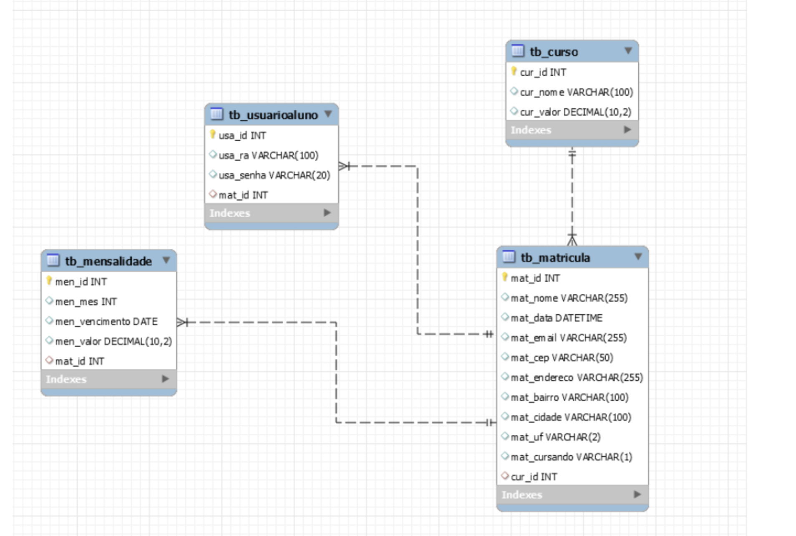

# api-unileste
API RESTful da UNILESTE (Universidade do Leste Paulista) para criar o processo de matrícula dos alunos na instituição. 

## Tecnologias utilizadas
 - Node.js
 - Express
 - Swagger
 - JSON WEB TOKEN (JWT)
 - MY SQL
 - Cookie

## Endpoints implementados

- Consulta de cursos cadastrados 

- Realizar matrícula, gerar mensalidades e gerar aluno com RA e Senha. 

- Autenticação com JWT, por meio do RA e Senha 

- Consultar mensalidades de um determinado aluno, identificando pelo token de autenticação  

Todos os esses endpoints estão devidamente documentados na rota do sistema /docs. 

## Como executar?
 1) npm install
 2) npm start
 3) acessar a url [http://localhost:5000/docs/](http://localhost:5000/docs/)

 ## Modelo Relacional
